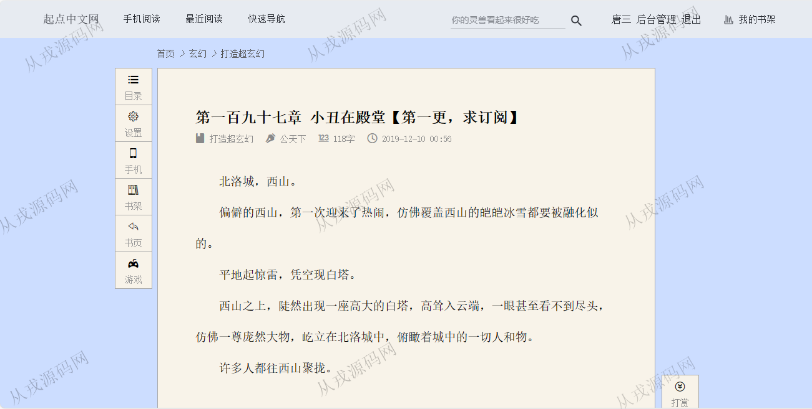
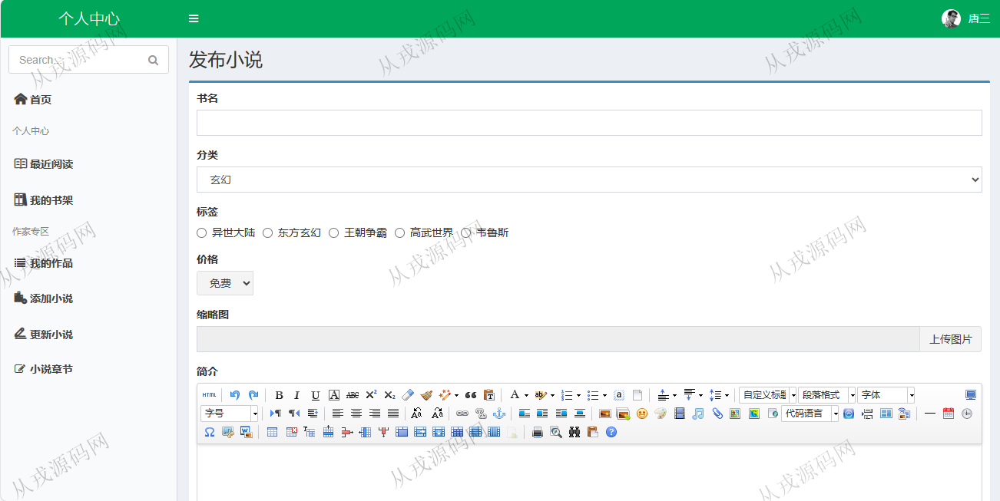
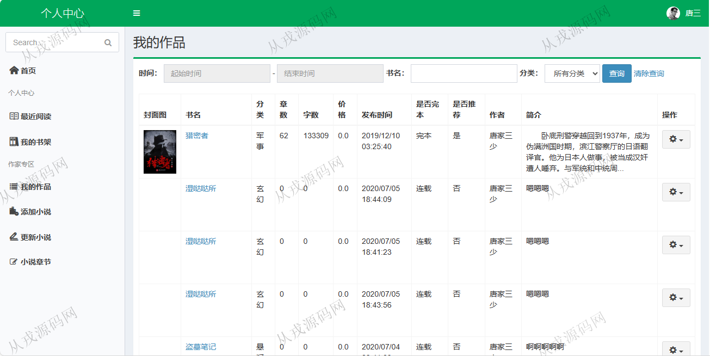
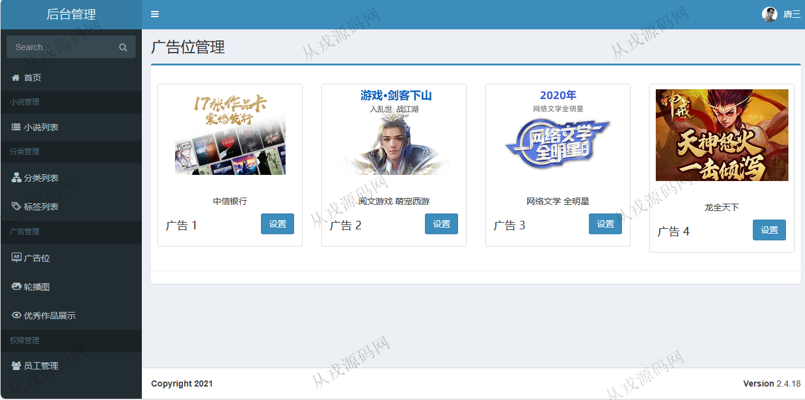
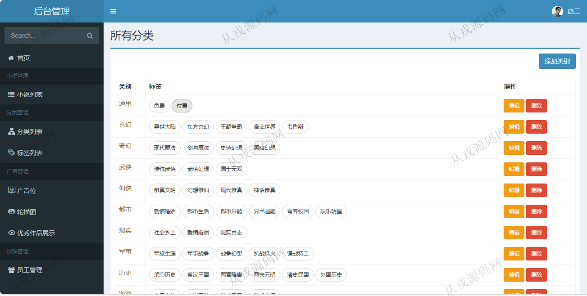

<h1 align="center">112.小说网管理系统</h1>

- <b>完整代码获取地址：从戎源码网 ([https://armycodes.com/](https://armycodes.com/))</b>
- <b>技术探讨、资料分享，请加QQ群：692619798</b> 
- <b>作者微信：19941326836  QQ：952045282</b> 
- <b>承接计算机毕业设计、Java毕业设计、Python毕业设计、深度学习、机器学习</b>
- <b>选题+开题报告+任务书+程序定制+安装调试+论文+答辩ppt 一条龙服务</b>
- <b>所有选题地址 ([https://github.com/YuLin-Coder/AllProjectCatalog](https://github.com/YuLin-Coder/AllProjectCatalog)) </b>

## 项目介绍
基于ssm的小说网管理系统：前端 jsp、jquery，后端 maven、springmvc、spring、mybatis，角色分为管理员、用户；集成小说展示，小说在线阅读，我的书架等功能于一体的系统。

## 功能介绍

### 用户

- 基本功能：登录、注册、退出
- 网站首页：作品分类，主导航，编辑推荐，本周强推，新书推荐、排行榜
- 小说：列表展示，小说介绍页面，免费试读，加入书架，目录展示，分卷阅读
- 我的书架：最近阅读，书架列表，成为作家

### 管理员

- 看板：用户访问量（折线图），统计
- 小说管理：小说列表，多条件搜索查询，详情查看，推荐，取消推荐，编辑，删除
- 广告管理：广告位列表，广告位设置，轮播图设置，优秀作品展示配置

## 环境

- <b>IntelliJ IDEA 2021.3</b>

- <b>Mysql 5.7.26</b>

- <b>Tomcat 7.0.73</b>

- <b>JDK 1.8</b>

## 运行截图

